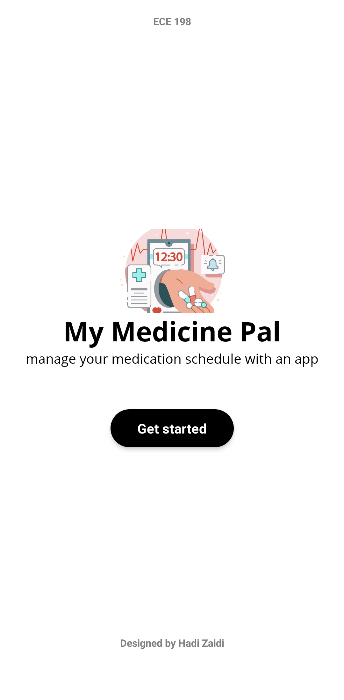
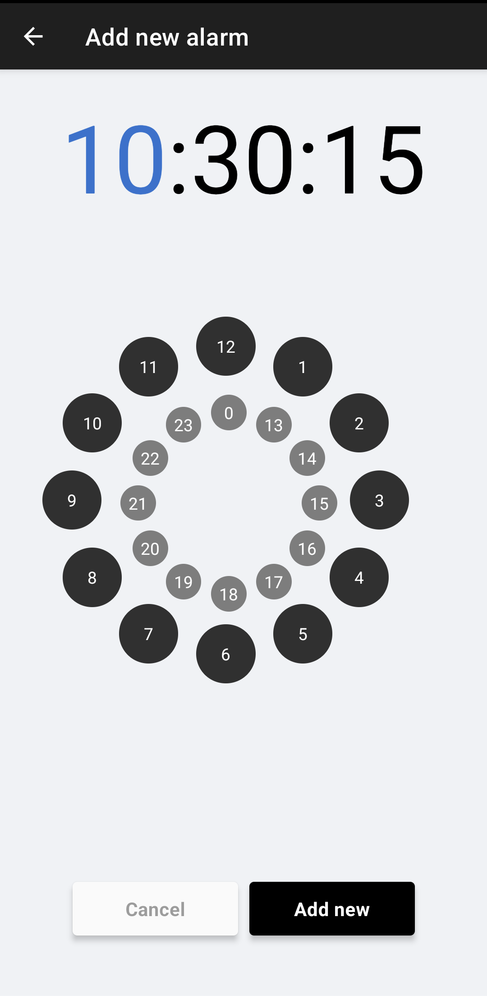
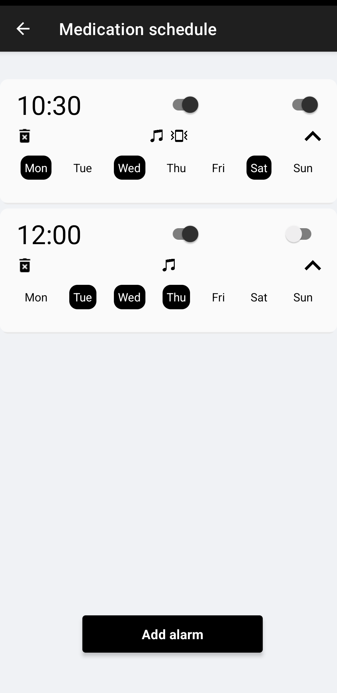

# Smart Medicine Box
A medication schedule manager built on an STM32 microcontroller with a companion React Native app, developed for ECE 198: Project Studio at the University of Waterloo.

The mobile app connects to the STM32 via BLE communications, and this is done using a custom programmed button on the microcontroller. Once connected, the user can start the app and go through the following workflow to set medication reminders on their device:

|  |  |  |
| --- | --- | --- |

Once the alarm goes off on the STM32, the user must disable it via a physical button to mark their medication as taken. An emergency contact can be called if the medication is not taken within 1 hour.